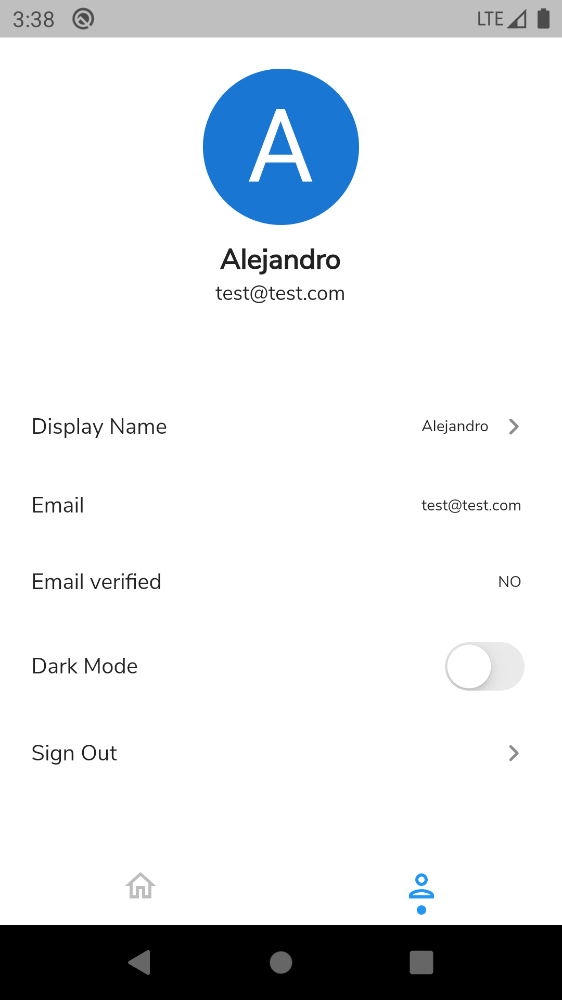

# LOGIN

## firebase login with facebook, google and email.

```text
application made with status manager with repository pattern for login with google, facebook + firebaseAuth.
```
  

  <table>
    <thead>
      <tr>
        <th><Strong>HOME</Strong></th>
        <th><Strong>RESET PASSWORD</Strong></th>
      </tr>
    </thead>
    <tbody>
        <tr>
            <td> </td>
            <td> </td>
        </tr>
        <tr>
        <th><Strong>SIGN UP</Strong></th>
        <th><Strong>LOGIN VALIDATION</Strong></th>
      </tr>
        <tr>
           <td> </td>
            <td> </td>
        </tr>
        <tr>
        <th><Strong>LOGIN SHOW PASSWORD</Strong></th>
        <th><Strong>PROFILE LIGHT</Strong></th>
      </tr>
        <tr>
           <td> </td>
            <td> </td>
        </tr>
        <tr>
        <th><Strong>UPDATE DISPLAY NAME</Strong></th>
        <th><Strong>PROFILE DARK</Strong></th>
      </tr>
        <tr>
           <td> </td>
            <td> </td>
        </tr>
        <tr>
        <th><Strong>LOGIN DARK</Strong></th>
        <th><Strong>SIGN UP DARK</Strong></th>
      </tr>
        <tr>
           <td> </td>
            <td> </td>
        </tr>
        <tr>
        <th><Strong>RESET PASSWORD DARK</Strong></th>
        <th><Strong>VALIDATION DARK</Strong></th>
      </tr>
        <tr>
           <td> </td>
            <td> </td>
        </tr>
        <tr>
        <th><Strong>GOOGLE LOGIN DARK</Strong></th>
        <th><Strong>GOOGLE PROFILE DARK</Strong></th>
      </tr>
        <tr>
           <td> </td>
            <td> </td>
        </tr>
    </tbody>
  </table>